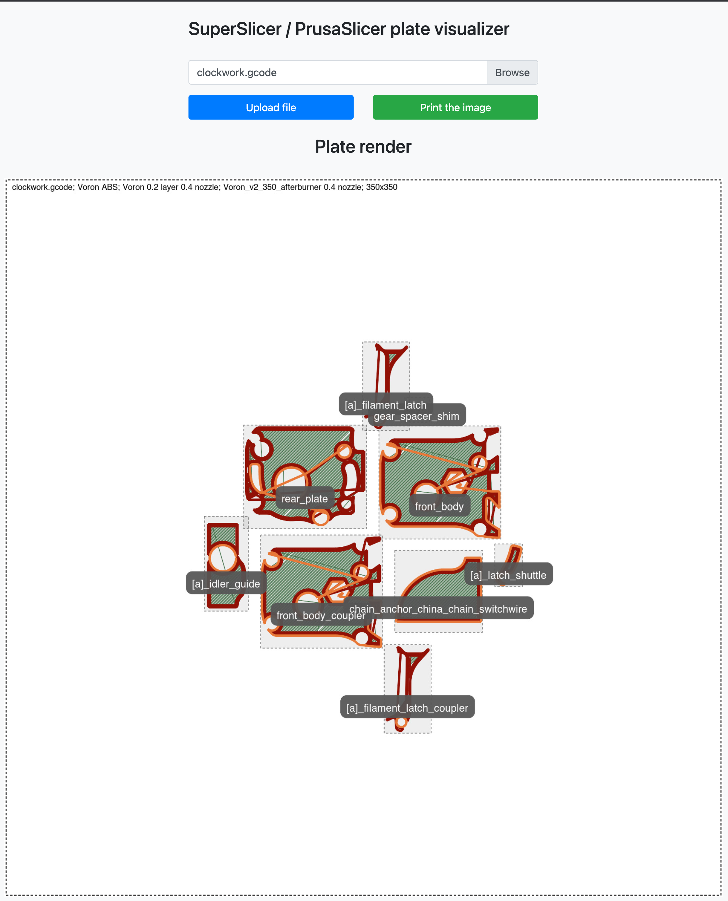

SuperSlicer / PrusaSlicer plate visualizer

Why? Because you want to rememer which parts are where when you print a lot.

Stability? "Should work"

Pull requests and suggestions? Highly welcome.

Rendering and line type detection is currently glitchy, the same with not rendering travel moves - work in progress!

